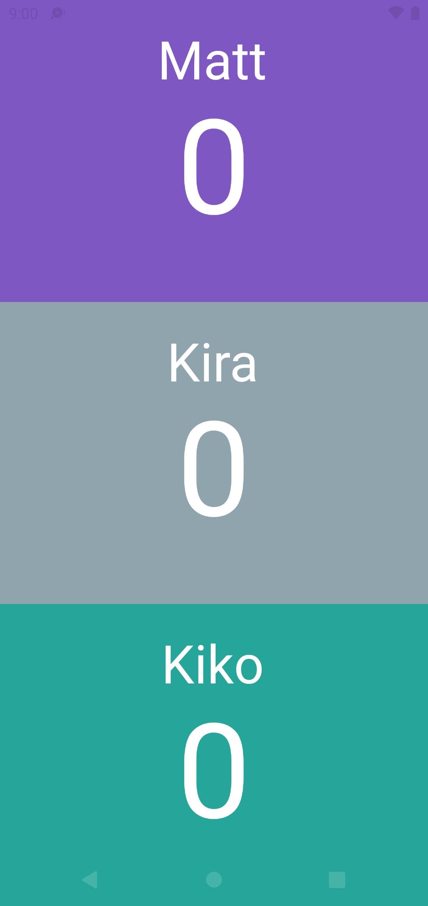

	

# Scored!

Scored! allow you to keep track of everything you want!

## Links

-   [Web App](https://scored.gitlab.io)
-   [Google Play](https://play.google.com/store/apps/details?id=be.tteo.scored)

## Screenshots

    
    
    
    
    
    

## Stack

-   Flutter
-   Hive
-   Provider

## How to build

### In the terminal

-   Install the dependencies `flutter pub get`
-   Web : `flutter build web`
-   Android : `flutter build appbundle`
-   MacOS (only on a mac) : `flutter build macos`
-   Windows (only on windows) : `flutter build macos`
-   Linux (only on linux) : `flutter build linux`

## How to deploy

### Deploy Web

The Gitlab pipeline found in [.gitlab-cy.yml](./gitlab-ci.yml) automatically build and deploy the web version on [Gitlab pages](https://scored.gitlab.io)

### Deploy Android

First, update the version code in pubspec.yaml and run `flutter build apk` or `flutter run` to update the version where needed.

Deployment is handled by fastlane, with different lanes :

-   Internal testing : `bundle exec fastlane internal`
-   Production : `bundle exec fastlane production`

## How to add an entity

-   Create the domain class (eg. game.dart)
-   Add the 'part' (eg. `game.g.dart`) which will be the name of the generated TypeAdapter
-   Annotate the class with `@HiveType(id)` (where id is the biggest index so far +1)
-   Annotate every fields with `@HiveField(id)` (with every id being unique in the class)
-   Run `flutter packages pub run build_runner build` to generate the TypeAdapter
